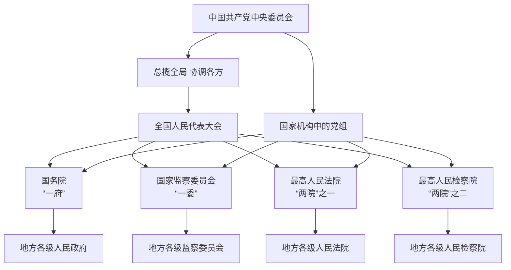

# 中国国家机构与党组织体系总览

## 一、国家机构体系：“一府一委两院”

根据《中华人民共和国宪法》，“一府一委两院”是指由各级人民代表大会产生的国家行政机关、监察机关、审判机关和检察机关。在中央层面，即**中华人民共和国国务院**、**中华人民共和国国家监察委员会**、**中华人民共和国最高人民法院**和**中华人民共和国最高人民检察院**。

### 1. 人民政府（“一府”）

人民政府是国家的行政机关，是各级国家权力机关（人大）的执行机关。

#### （1）中央人民政府：中华人民共和国国务院

国务院是最高国家行政机关，对全国人民代表大会及其常务委员会负责。

##### ① 国务院办公厅

##### ② 国务院组成部门（26个）

| 序号 | 机构名称 | 备注 |
| :---: | :--- | :--- |
| 1 | 中华人民共和国外交部 | |
| 2 | 中华人民共和国国防部 | |
| 3 | 中华人民共和国国家发展和改革委员会 | |
| 4 | 中华人民共和国教育部 | 对外保留国家语言文字工作委员会牌子 |
| 5 | 中华人民共和国科学技术部 | |
| 6 | 中华人民共和国工业和信息化部 | 对外保留国家航天局、国家原子能机构牌子 |
| 7 | 中华人民共和国国家民族事务委员会 | |
| 8 | 中华人民共和国公安部 | |
| 9 | 中华人民共和国国家安全部 | |
| 10 | 中华人民共和国民政部 | |
| 11 | 中华人民共和国司法部 | |
| 12 | 中华人民共和国财政部 | |
| 13 | 中华人民共和国人力资源和社会保障部 | 加挂国家外国专家局牌子 |
| 14 | 中华人民共和国自然资源部 | 对外保留国家海洋局牌子 |
| 15 | 中华人民共和国生态环境部 | 对外保留国家核安全局牌子 |
| 16 | 中华人民共和国住房和城乡建设部 | |
| 17 | 中华人民共和国交通运输部 | |
| 18 | 中华人民共和国水利部 | |
| 19 | 中华人民共和国农业农村部 | 加挂国家乡村振兴局牌子 |
| 20 | 中华人民共和国商务部 | |
| 21 | 中华人民共和国文化和旅游部 | |
| 22 | 中华人民共和国国家卫生健康委员会 | |
| 23 | 中华人民共和国退役军人事务部 | |
| 24 | 中华人民共和国应急管理部 | |
| 25 | 中国人民银行 | |
| 26 | 中华人民共和国审计署 | |

##### ③ 国务院直属特设机构（1个）

- 国务院国有资产监督管理委员会

##### ④ 国务院直属机构（17个）

- 中华人民共和国海关总署
- 国家税务总局
- 国家市场监督管理总局（对外保留国家反垄断局、国家认证认可监督管理委员会、国家标准化管理委员会牌子）
- 国家金融监督管理总局
- 中国证券监督管理委员会
- 国家广播电视总局
- 国家体育总局
- 国家信访局
- 国家统计局
- 国家知识产权局
- 国家国际发展合作署
- 国家医疗保障局
- 国务院参事室
- 国家机关事务管理局

> **注**：国家新闻出版署（国家版权局）在中央宣传部加挂牌子；国家宗教事务局在中央统战部加挂牌子。

##### ⑤ 国务院办事机构

- 国务院研究室
- 国务院侨务办公室（在中央统战部加挂牌子）
- 国务院港澳事务办公室（与中共中央港澳工作办公室一个机构两块牌子）
- 国务院台湾事务办公室（与中共中央台湾工作办公室一个机构两块牌子）
- 国家互联网信息办公室（与中央网络安全和信息化委员会办公室一个机构两块牌子）
- 国务院新闻办公室（在中央宣传部加挂牌子）

##### ⑥ 国务院直属事业单位

- 新华通讯社
- 中国科学院
- 中国社会科学院
- 中国工程院
- 国务院发展研究中心
- 中央广播电视总台
- 中国气象局
- 国家行政学院（与中央党校一个机构两块牌子）

#### （2）地方各级人民政府

地方各级人民政府是地方各级国家行政机关，对本级人民代表大会和上一级国家行政机关负责并报告工作。

包括以下层级：

- **省、自治区、直辖市人民政府**
- **设区的市、自治州人民政府**
- **县、自治县、不设区的市、市辖区人民政府**
- **乡、民族乡、镇人民政府**

地方各级政府一般设有与发展改革、教育、科技、公安、民政、司法、财政、人社、自然资源、生态环境、住建、交通、水利、农业农村、商务、文旅、卫健等部门相对应的组成机构。

---

### 2. 监察委员会（“一委”）

监察委员会是国家的监察机关，对所有行使公权力的公职人员进行监督。

#### （1）国家监察委员会

中华人民共和国国家监察委员会是最高监察机关，由全国人民代表大会产生，对其负责，受其监督。

- **领导体制**：设主任一名，副主任若干名，委员若干名。主任由全国人民代表大会选举产生。
- **合署办公**：国家监察委员会与中国共产党中央纪律检查委员会合署办公，实行一套工作机构、两个机关名称。

##### 内设机构（31个职能部门）

| 类别 | 机构名称 |
| :--- | :--- |
| 综合部门 | 办公厅、组织部、宣传部、研究室、法规室 |
| 监督部门 | 党风政风监督室、信访室、中央巡视工作领导小组办公室、案件监督管理室 |
| 监督检查室 | 第一监督检查室、第二监督检查室、第三监督检查室、第四监督检查室、第五监督检查室、第六监督检查室、第七监督检查室、第八监督检查室、第九监督检查室、第十监督检查室、第十一监督检查室 |
| 审查调查室 | 第十二审查调查室、第十三审查调查室、第十四审查调查室、第十五审查调查室、第十六审查调查室 |
| 其他部门 | 案件审理室、纪检监察干部监督室、国际合作局、机关事务管理局、机关党委、离退休干部局 |

##### 直属单位

- 中国纪检监察杂志社
- 中国纪检监察报社
- 中国方正出版社
- 网络中心
- 网络技术中心
- 机关综合服务中心
- 信息中心
- 中国纪检监察学院
- 中国纪检监察学院北戴河校区

#### （2）地方各级监察委员会

- 省、自治区、直辖市监察委员会
- 设区的市、自治州监察委员会
- 县、自治县、不设区的市、市辖区监察委员会

> **注**：乡镇一级不设监察委员会，但可通过派驻或派出机构方式行使监察职能。

---

### 3. 人民法院（“两院”之一）

人民法院是国家的审判机关。

#### （1）最高人民法院

最高人民法院是最高审判机关，负责审理各类案件，制定司法解释，监督地方各级人民法院和专门人民法院的审判工作。

##### 内设机构

| 类别 | 机构名称 |
| :--- | :--- |
| 综合部门 | 办公厅（加挂新闻局牌子）、政治部（内设4个机构） |
| 刑事审判 | 刑事审判第一庭、第二庭、第三庭、第四庭、第五庭 |
| 民事审判 | 民事审判第一庭、第二庭、第三庭、第四庭 |
| 专门审判 | 环境资源审判庭、行政审判庭、审判监督庭 |
| 业务部门 | 立案庭、赔偿委员会办公室、执行局（加挂执行指挥办公室牌子）、研究室、审判管理办公室 |
| 监督部门 | 督察局（加挂巡视工作领导小组办公室牌子） |
| 外事与保障 | 国际合作局、司法行政装备管理局 |
| 党务后勤 | 机关党委、离退休干部局 |

##### 巡回法庭（6个）

- 第一巡回法庭（加挂“第一国际商事法庭”牌子）
- 第二巡回法庭
- 第三巡回法庭
- 第四巡回法庭
- 第五巡回法庭
- 第六巡回法庭（加挂“第二国际商事法庭”牌子）

##### 直属事业单位

- 国家法官学院（加挂最高人民法院法官国际交流中心、最高人民法院司法案例研究院牌子）
- 中国应用法学研究所
- 人民法院新闻传媒总社
- 最高人民法院机关服务中心
- 人民法院信息技术服务中心

##### 直属企业

- 人民法院出版社有限公司

#### （2）地方各级人民法院

分为四级（含基层）：

- **高级人民法院**：设于省、自治区、直辖市
- **中级人民法院**：设于省和自治区的各地区、省和自治区所辖市、自治州（盟）以及直辖市
- **基层人民法院**：设于县、自治县（旗）、不设区的市、市辖区

此外，设有**专门人民法院**：

- 军事法院
- 海事法院
- 知识产权法院
- 金融法院
- 其他专门法院

---

### 4. 人民检察院（“两院”之二）

人民检察院是国家的法律监督机关。

#### （1）最高人民检察院

最高人民检察院是最高检察机关，领导地方各级人民检察院和专门人民检察院的工作，对全国人民代表大会及其常务委员会负责。

##### 领导成员（现任）

- 党组书记、检察长：应勇
- 党组副书记、分管日常工作的副检察长
- 党组成员、副检察长
- 党组成员、中央纪委国家监委驻最高人民检察院纪检监察组组长
- 副检察长
- 检察委员会专职委员

##### 内设机构

| 类别 | 机构名称 |
| :--- | :--- |
| 综合部门 | 办公厅（新闻办公室） |
| 业务检察厅 | 第一检察厅、第二检察厅、第三检察厅、第四检察厅、第五检察厅、第六检察厅、第七检察厅、第八检察厅、第九检察厅、第十检察厅（共10个） |
| 研究部门 | 法律政策研究室、案件管理办公室 |
| 其他部门 | （此外设有政治部、机关党委等） |

#### （2）地方各级人民检察院

分为三级：

- **省、自治区、直辖市人民检察院**
- **省、自治区、直辖市人民检察院分院，自治州和省辖市人民检察院**（设区的市级人民检察院）
- **县、市、自治县、市辖区人民检察院**

此外，设有**专门人民检察院**：

- 军事检察院
- 其他专门检察院

---

## 二、中国共产党组织体系

中国共产党组织由中央组织、地方组织和基层组织三个层次构成，并设有党组（党委）和纪律检查机关。

### 1. 党的中央组织

党的中央组织是党的首脑机关，领导全党工作。

#### （1）党的全国代表大会
- **性质**：党的最高领导机关
- **职权**：听取和审查中央委员会报告；审查中央纪律检查委员会报告；讨论并决定党的重大问题；修改党章；选举中央委员会和中央纪律检查委员会

#### （2）中央委员会
- 由全国代表大会选举产生
- 是大会闭会期间党的最高领导机关
- 每届任期五年

#### （3）中央政治局
- 由中央委员会全体会议选举产生
- 在中央委员会闭会期间行使中央委员会职权

#### （4）中央政治局常务委员会
- 由中央委员会全体会议选举产生
- 在中央政治局闭会期间行使中央政治局职权

#### （5）中央委员会总书记
- 由中央委员会全体会议选举产生
- 负责召集中央政治局会议和中央政治局常务委员会会议

#### （6）中央书记处
- 中央政治局及其常务委员会的办事机构
- 成员由中央政治局常务委员会提名，中央委员会全体会议通过

#### （7）中央军事委员会
- 党的最高军事领导机关
- 由中央委员会决定

#### （8）中央纪律检查委员会
- 党的检查监督机关
- 由党的全国代表大会选举产生

#### （9）党中央各部门

| 序号 | 机构名称 | 备注 |
| :---: | :--- | :--- |
| 1 | 中央纪律检查委员会、国家监察委员会机关 | 合署办公 |
| 2 | 中共中央办公厅 | |
| 3 | 中共中央组织部 | 对外加挂国家公务员局牌子 |
| 4 | 中共中央宣传部 | 加挂中央精神文明建设办公室、国务院新闻办公室、国家新闻出版署、国家版权局、国家电影局牌子 |
| 5 | 中共中央统一战线工作部 | |
| 6 | 中共中央对外联络部 | |
| 7 | 中共中央政法委员会 | |
| 8 | 中央政策研究室 | |
| 9 | 中央机构编制委员会办公室 | |
| 10 | 中央港澳工作办公室 | |
| 11 | 中央和国家机关工作委员会 | |
| 12 | 中央社会工作部 | |
| 13 | 中央金融委员会办公室、中央金融工作委员会 | |
| 14 | 中央科技委员会办公室 | |
| 15 | 中央网络安全和信息化委员会办公室 | 与国家互联网信息办公室一个机构两块牌子 |
| 16 | 中央台湾工作办公室 | 与国务院台湾事务办公室一个机构两块牌子 |

#### （10）党中央直属事业单位

- 中央党校（国家行政学院）（一个机构两块牌子）
- 中央党史和文献研究院
- 人民日报社
- 求是杂志社
- 光明日报社
- 其他

---

### 2. 党的地方组织

党的地方组织是按照行政区域设置的各级党的组织，是党的地方领导机关。

| 层级 | 机构名称 |
| :--- | :--- |
| 省级 | 省、自治区、直辖市委员会 |
| 地市级 | 设区的市、自治州委员会 |
| 县级 | 县（旗）、自治县、不设区的市、市辖区委员会 |

#### 相关数据（截至2023年底）

| 项目 | 数量 |
| :--- | :---: |
| 省级党的委员会 | 31个 |
| 市级党的委员会 | 333个 |
| 县级党的委员会 | 2,859个 |

> **说明**：各级地方党委均设有常务委员会和纪律检查委员会；党的中央和地方各级委员会可向非党组织派出代表机关（如党工委）。

---

### 3. 党的基层组织

党的基层组织是党在社会基层单位中的战斗堡垒，是党的全部工作和战斗力的基础。

#### （1）设立标准

| 类型 | 设立条件 |
| :--- | :--- |
| **基层党委** | 党员人数超过100名 |
| **党总支** | 党员人数超过50名、不足100名 |
| **党支部** | 正式党员超过3名、不足50名 |

> **补充**：党员人数不足3名的，可与邻近单位联合成立党支部。

#### （2）设立范围

党的基层组织设立于以下各类基层单位：

- 企业
- 农村
- 机关
- 学校
- 科研院所
- 街道社区
- 社会组织
- 人民解放军连队
- 其他基层单位

#### （3）相关数据（截至2023年底）

- 全国共设立基层党组织：**360.7万个**

---

### 4. 党组（党委）

党组是党在中央和地方国家机关、人民团体、经济组织、文化组织和其他非党组织的领导机关中设立的领导机构。

#### （1）党组的功能定位

- 发挥**领导核心作用**
- 负责确保党的路线、方针、政策在本单位得到贯彻执行
- 讨论和决定本单位的重大问题

#### （2）党组的主要任务

- 贯彻落实党的路线方针政策
- 讨论决定本单位的重大问题
- 做好干部管理工作
- 团结非党干部和群众
- 完成党和国家交给的任务
- 指导机关和直属单位党组织的工作

---

### 5. 党的纪律检查机关

#### （1）组织层级

- **党的中央纪律检查委员会**（中央纪委）
- **党的地方各级纪律检查委员会**（省级纪委、地市级纪委、县级纪委）
- **党的基层纪律检查委员会**
- **派出机构**（如派驻纪检监察组）

#### （2）主要任务

- 维护党的章程和其他党内法规
- 检查党的路线、方针、政策和决议的执行情况
- 协助党的委员会加强党风建设和组织协调反腐败工作

#### （3）与国家监委的关系

中央纪委与国家监委**合署办公**，地方各级纪委与同级监委合署办公，实行一套工作机构、两个机关名称，履行纪检、监察两项职能。

## 三、国家机构与党组织关系总览

### 关系示意图

### 核心关系说明

| 关系维度 | 具体内容 |
| :--- | :--- |
| **产生与负责关系** | “一府一委两院”均由同级人民代表大会产生，对其负责，受其监督。 |
| **党的领导方式** | 党通过“总揽全局、协调各方”的方式，对“一府一委两院”实行政治领导、思想领导和组织领导。 |
| **党组嵌入** | 在“一府一委两院”内部设立党组（党委），确保党的路线方针政策在本单位得到贯彻落实。 |
| **党政分工** | 党委侧重决策、总揽协调；政府侧重执行落实；监察机关专责监督；司法机关依法独立行使审判权和检察权。 |

---

> **说明**：以上内容依据《中华人民共和国宪法》《中国共产党章程》及相关机构编制规定整理，机构名称、设置及职能以官方最新文件为准。